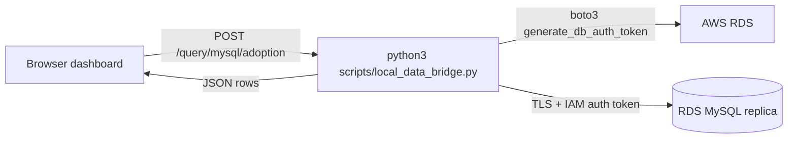

# Lambda Performance Calculator

Reusable workflow for collecting AWS Lambda CloudWatch data and turning it into a concise performance/RCA report.

> **First time setting this up?** See [INSTALLATION.md](INSTALLATION.md) for the 7-step laptop runbook (Python, venv, `.env`, bridge, dashboard).

## What this repo contains

- `scripts/cloudwatch_review_collect.sh`
  Collects Lambda configuration, metrics, log counts, top messages, and `REPORT` analysis into artifact files.
- `scripts/run_cloudwatch_review.py`
  Interactive automation that runs the collector, parses the generated artifact files, and writes the final markdown report.
- `docs/templates/lambda_cloudwatch_review.template.md`
  Generic markdown template for the final report.
- `prompts/fill_lambda_cloudwatch_review.prompt.md`
  Prompt instructions for turning collected artifact files into the final markdown report.
- `examples/sample_lambda_cloudwatch_review.md`
  Sample final report output.
- `scripts/gpt_rollout_health_dashboard.py`
  Standalone dashboard generator that merges a Pinot latency CSV and a MySQL adoption CSV into a `merged_metrics.csv` + `dashboard.png` for daily GPT rollout health monitoring.
- `dashboards/gpt_rollout_dashboard.html`
  Self-contained drag-and-drop browser version of the dashboard (same logic, runs 100% client-side, downloads PNG + CSV).
- `examples/sample_pinot_metrics.csv`, `examples/sample_mysql_metrics.csv`
  Sample inputs for the GPT rollout health dashboard (work with both the Python and HTML versions).

## Default behavior

If you run the collector without arguments, it uses:

- `env=prod`
- `end=current UTC time`
- `start=one week before current UTC time`
- default Lambdas:
  - `zen-{env}-sqs-message-consumer`
  - `zen-{env}-ws-to-sqs-producer`
  - `zen_{env}_authorizer_service`
  - `zen_{env}_practice_lrs_event_publisher`

## Step 1: Collect CloudWatch data

From the project root:

```bash
cd "/Users/rohinsandhu/Documents/zenarate/lambda_performance_calculator"
./scripts/cloudwatch_review_collect.sh
```

Example for another environment:

```bash
./scripts/cloudwatch_review_collect.sh --env qa2
```

Example with explicit dates:

```bash
./scripts/cloudwatch_review_collect.sh \
  --env beta \
  --start 2026-04-20T00:00:00Z \
  --end 2026-04-27T23:59:59Z
```

Example with custom Lambda names:

```bash
./scripts/cloudwatch_review_collect.sh \
  --env dev \
  --lambda zen-dev-sqs-message-consumer \
  --lambda zen-dev-ws-to-sqs-producer \
  --lambda zen_dev_authorizer_service
```

## Step 2: Use the generated artifacts to create the report

After the script finishes, it creates a folder like:

```text
artifacts/cloudwatch-review/<run-id>/
```

Important files inside:

- `metadata.txt`
- `config.txt`
- `metrics_invocations.txt`
- `metrics_duration.txt`
- `metrics_concurrency.txt`
- `logs_error_counts.txt`
- `logs_top_messages.txt`
- `logs_report.txt`
- `context.txt`

Use these with:

- template: `docs/templates/lambda_cloudwatch_review.template.md`
- prompt: `prompts/fill_lambda_cloudwatch_review.prompt.md`

The final markdown output should be saved locally under:

```text
reports/{env}_{execution_date}_websocket_reports.md
```

Example:

```text
reports/prod_2026-04-27_websocket_reports.md
```

Recommended input set for the AI step:

1. `docs/templates/lambda_cloudwatch_review.template.md`
2. `prompts/fill_lambda_cloudwatch_review.prompt.md`
3. `artifacts/cloudwatch-review/<run-id>/context.txt`

Or, if needed, provide the individual artifact files listed in the prompt.

## Step 3: Run the full automation

No external Python package is required. The automation uses the standard library only.

You can optionally create a local `.env` file from `.env.example` to provide defaults such as `AWS_REGION`. The automation auto-loads `.env` from the repo root.

Run the interactive workflow:

```bash
python3 scripts/run_cloudwatch_review.py
```

The script will:

1. prompt for environment, region, **time range preset** (daily / weekly / biweekly / monthly / custom), and Lambda names
2. run `scripts/cloudwatch_review_collect.sh`
3. parse the generated artifact files directly
4. apply the **ignore-messages filter** (default: drops `should_flush.emergency_accumulation` from top-messages and from each Lambda's warning/error counts)
5. fill the markdown template deterministically
6. save the report to `reports/{env}_{execution_date}_websocket_reports.md`
7. emit a parallel **lambda metrics CSV** at `reports/{env}_{execution_date}_lambda_metrics.csv` that the browser dashboard consumes

### Time range presets

The first prompt accepts one of `daily`, `weekly` (default), `biweekly`, `monthly`, or `custom`. Each preset is a **rolling window ending at "now UTC"** — the start is exactly `N × 24h` earlier, so the window is always full regardless of what time of day you run the script.

- `daily`    — now − 24h → now (e.g. running at 2PM IST on May 14 covers 2PM IST May 13 → 2PM IST May 14)
- `weekly`   — now − 7 days → now
- `biweekly` — now − 14 days → now
- `monthly`  — now − 30 days → now
- `custom`   — falls back to the original two ISO 8601 prompts.

### Ignoring noisy log messages

Some recurring `ERROR` lines are expected and should not count as failures (e.g. `should_flush.emergency_accumulation`, which is internal buffering bookkeeping). The script ships with a default ignore list and accepts overrides at three levels:

```bash
# Add patterns via CLI (repeatable; case-insensitive substring match).
python3 scripts/run_cloudwatch_review.py --ignore-message "lrs not configured"

# Or via env var (comma-separated).
CW_REVIEW_IGNORE_MESSAGES="pattern_one,pattern_two" python3 scripts/run_cloudwatch_review.py

# Drop the built-in defaults entirely.
python3 scripts/run_cloudwatch_review.py --no-default-ignores
```

When patterns match, occurrences are stripped from the top-messages list **and** subtracted from each Lambda's `error_count` / `warning_count` (floored at zero), so the markdown report and the lambda CSV always agree. The active ignore list is also surfaced as a bullet under the report's Notes section.

### Lambda metrics CSV output

Every run also writes `reports/{env}_{execution_date}_lambda_metrics.csv` with this schema (designed to be consumed directly by the browser dashboard):

```text
lambda_name, invocations, lambda_errors, throttles,
avg_duration_ms, p95_duration_ms, p99_duration_ms, max_duration_ms,
cold_starts, avg_init_duration_ms,
warning_count, error_count,
top_errors, top_warnings
```

`top_errors` / `top_warnings` are encoded as `message:count; message:count` (semicolon-separated; colons inside messages are replaced with spaces so the format stays unambiguous).

## Output expectation

The final generated report should be a concise markdown file covering:

- scope
- executive summary
- key findings
- application error signals
- RCA summary
- recommended next steps

## GPT rollout health dashboard

`scripts/gpt_rollout_health_dashboard.py` is a small, standalone tool meant to be run daily after exporting fresh CSVs from Pinot (latency) and MySQL (adoption). It does not connect to any database — CSV in, dashboard + CSV out.

Install runtime dependencies (pandas + matplotlib) once:

```bash
pip install -r requirements.txt
```

Run against the bundled samples:

```bash
python3 scripts/gpt_rollout_health_dashboard.py \
  --pinot-csv examples/sample_pinot_metrics.csv \
  --mysql-csv examples/sample_mysql_metrics.csv \
  --output-dir reports/gpt_rollout/$(date -u +%F)
```

Outputs (placed inside `--output-dir`):

- `merged_metrics.csv` — merged + health-classified summary, sorted by `p95_ttfb_ms` descending.
- `dashboard.png` — 3-panel matplotlib dashboard (p95 bar chart, sessions bar chart, adoption-vs-latency scatter) with GREEN / YELLOW / RED coloring.

Default `health_status` rules:

- `GREEN`  — `p95_ttfb_ms < 5000` AND `p99_ttfb_ms < 8000`
- `RED`    — `p95_ttfb_ms > 8000` OR `p99_ttfb_ms > 15000`
- `YELLOW` — everything else (typical warning zone)

Thresholds can be tightened or relaxed at the CLI:

```bash
python3 scripts/gpt_rollout_health_dashboard.py \
  --pinot-csv pinot.csv --mysql-csv mysql.csv \
  --p95-green-max-ms 3000 --p95-red-min-ms 6000 \
  --p99-green-max-ms 6000 --p99-red-min-ms 12000
```

Expected input columns:

- Pinot CSV: `brand_id, total_requests, avg_ttfb_ms, p50_ttfb_ms, p95_ttfb_ms, p99_ttfb_ms`
- MySQL CSV: `brand_id, brand_name, total_sessions, total_utterances, avg_utterances_per_session`
- Lambda CSV (optional, browser dashboard only): produced by `scripts/run_cloudwatch_review.py` — see "Lambda metrics CSV output" above for the column list.

### Browser version (drag & drop)

If you don't want to set up Python, just open `dashboards/gpt_rollout_dashboard.html` in any modern browser:

```bash
open dashboards/gpt_rollout_dashboard.html
```

- Three independent drop zones: **Pinot CSV**, **MySQL CSV**, and **Lambda CloudWatch CSV** (the one produced by `scripts/run_cloudwatch_review.py`).
- Drop any subset of the three — the report renders whichever sections have data:
  - Pinot + MySQL together → **Brand health** section (insight cards, colored summary table, 3-panel chart).
  - Lambda CSV alone → **Lambda health** section (insight cards, metrics table, application error signals, 2-panel chart).
  - All three → both sections stacked in one report.
- Optionally tweak the brand-health thresholds.
- Click **Generate dashboard** to render, then:
  - **Download report (PNG)** — one tall image containing every visible section.
  - **Download report (HTML)** — single self-contained HTML you can paste anywhere.
  - **Download charts only (PNG)** — just the canvas chart.
  - **Download merged_metrics.csv** — the brand-health table (enabled only when brand data is loaded).
  - **Download lambda_metrics.csv** — the lambda-health table, re-emitted in the schema produced by the Python script (enabled only when lambda data is loaded).

The page is fully self-contained (no external dependencies, no servers, no uploads — files never leave your machine). The merge, health classification, sort, and insights logic mirror `scripts/gpt_rollout_health_dashboard.py` and `scripts/run_cloudwatch_review.py`; the Node smoke test in `tests/smoke_dashboard_html.cjs` enforces parity for both pipelines on the sample CSVs.

### Fetch data live via the local bridge

The dashboard's CSV upload path is unchanged. There's now a second tab on each drop zone — **Fetch from bridge** — that pulls the same data straight from your account via a tiny localhost helper, so you never have to export and drag-drop CSVs.

How it works:



The bridge listens on `127.0.0.1` only — your data never crosses a remote server.

**One-time setup:**

```bash
# Install runtime deps:
pip install -r requirements.txt

# Copy the env template and fill in your RDS host / user / region.
cp .env.example .env  # then edit .env
```

**Each session:**

```bash
python3 scripts/local_data_bridge.py
```

The bridge prints something like:

```text
2026-05-14 14:30:01 INFO local_data_bridge: Local data bridge listening on http://127.0.0.1:8765
2026-05-14 14:30:01 INFO local_data_bridge: Bridge token: 7a8e4f1c... (paste into the dashboard's 'Bridge token' field)
```

Then in the browser dashboard:

1. Open `dashboards/gpt_rollout_dashboard.html` (or your Netlify URL).
2. The **Bridge connection** bar at the top is the single place to configure the bridge URL + token. Paste the bridge token from the terminal once — it's persisted in `localStorage` and used by every Fetch tab below. The status pill in the bar turns green when the bridge is reachable.
3. **(MySQL adoption)** Switch the **MySQL adoption CSV** zone to the **Fetch from RDS** tab. Adjust **Last N days** and **Brand IDs** if needed; defaults are `1` and `470,257,466,416,38,221,411,301`. Click **Fetch adoption metrics from RDS**.
4. **(Lambda from CloudWatch)** Switch the **Lambda CloudWatch CSV** zone to the **Fetch from bridge** tab. Tweak **Environment** (default `prod`), **AWS region** (default `us-west-1`), **Last N days** (default `1`), and optionally a custom **Lambda names** list (leave blank for the env defaults from `default_lambda_names`). The default ignore list (`should_flush.emergency_accumulation`) is applied unless you tick **Skip default ignores**, plus any extras you paste into **Extra ignore patterns**. Click **Fetch lambda metrics from CloudWatch**. This runs `scripts/cloudwatch_review_collect.sh` under the hood and can take 30–90s; the panel shows an elapsed-seconds ticker while it works.
5. **(Pinot from StarTree)** Switch the **Pinot latency CSV** zone to the **Fetch from bridge** tab. Paste your **Pinot bearer token** (the JWT you'd otherwise pass to curl); it persists in `localStorage` separately from the bridge token because it rotates daily. Tweak **Last N days** (default `1`) and **Brand IDs** if needed. Click **Fetch latency metrics from Pinot**. The bridge runs the hard-coded `pinot_latency.sql` (SELECT-only) and returns TTFB stats split by `conversation_turn`: **first utterance** (`turn = 1`) vs **follow-up** (`turn != 1`). The brand-health table renders both sets side-by-side; the per-row health pill is the **worst of the two buckets**, and any p95/p99 cell that exceeds the threshold in only one bucket gets a subtle warning tint so you can see which side is the problem.
6. **Generate dashboard**.

#### Pinot security notes

- The bridge runs **`scripts/sql/pinot_latency.sql` only** — the dashboard cannot supply arbitrary SQL. Only the `__WINDOW_MS__` (days × 86 400 000) and `__BRAND_IDS__` (validated positive ints) placeholders are substituted.
- Before each request, the bridge re-applies `assert_select_only()` to the rendered SQL. The guard checks: starts with `SELECT`, no `;` except optionally trailing, and rejects any of `INSERT`, `UPDATE`, `DELETE`, `DROP`, `ALTER`, `TRUNCATE`, `CREATE`, `GRANT`, `REVOKE`, `EXEC`, `CALL`, `MERGE`, `REPLACE`, `LOAD`, `RENAME`, `SET`. Even if the SQL file were maliciously edited, the guard refuses to forward it.
- The Pinot bearer token never leaves the laptop. It's stored in the browser's `localStorage` and sent only to `http://127.0.0.1:<bridge>/query/pinot/latency`; the bridge forwards it as the `Authorization: Bearer …` header to your StarTree tenant URL over TLS.
- The Pinot read replica is reachable only over the corporate VPN (Cisco AnyConnect). The bridge inherits the VPN routing from your laptop — if `curl https://pinot.<tenant>.cp.s7e.startree.cloud/sql` works in your terminal, the bridge call works.

Useful bridge CLI flags:

```bash
python3 scripts/local_data_bridge.py --port 9876   # custom port
python3 scripts/local_data_bridge.py --no-auth     # local dev only; skips X-Bridge-Token enforcement
python3 scripts/local_data_bridge.py --verbose     # debug-level logs
```

**Caveats:**

- **Safari** is stricter than Chrome / Edge / Firefox about HTTPS pages calling `http://127.0.0.1`. When using the bridge, open the dashboard from `file://`, `http://localhost`, or run Safari with **Develop -> Disable Cross-Origin Restrictions** for the session. Chrome/Firefox handle the loopback exception automatically.
- The bridge generates a fresh **bridge token** on every launch. Re-paste it into the dashboard after restarts (it lives in `localStorage` between page reloads but doesn't survive a bridge restart).
- The RDS user must be IAM-enabled (`CREATE USER … IDENTIFIED WITH AWSAuthenticationPlugin AS 'RDS'`) and your AWS credentials must include `rds-db:connect` for the resource ARN. If `aws rds generate-db-auth-token …` works from your terminal, the bridge will work too.
- The SQL is server-side fixed in [`scripts/sql/mysql_adoption.sql`](scripts/sql/mysql_adoption.sql); only `days` and `brand_ids` are user-controllable, and they're sent through PyMySQL parameterized placeholders.

### Deploy the dashboard to Netlify

Netlify is the lowest-friction way to share the dashboard as a public URL — no bucket policies, no Block Public Access fights, free TLS.

**No-script path (literally drag & drop):**

1. Open <https://app.netlify.com/drop>.
2. Drag `dashboards/gpt_rollout_dashboard.html` onto the page.
3. Netlify gives you a public URL instantly (e.g. `https://wonderful-mochi-1234.netlify.app/gpt_rollout_dashboard.html`).

**Scripted path (preferred for repeat / production deploys):**

```bash
# First-time setup: get a personal access token from
#   https://app.netlify.com/user/applications#personal-access-tokens
export NETLIFY_AUTH_TOKEN=xxx

# 1. Create a brand-new site and push to production.
./scripts/deploy_dashboard_to_netlify.sh --create-site zen-gpt-rollout
# -> https://zen-gpt-rollout.netlify.app/

# 2. Redeploy to an existing site (id from `netlify sites:list`).
./scripts/deploy_dashboard_to_netlify.sh --site <site-id>

# 3. Share a one-off snapshot at a draft URL without overwriting prod.
./scripts/deploy_dashboard_to_netlify.sh --site <site-id> --draft --samples

# 4. Preview every action without calling Netlify.
./scripts/deploy_dashboard_to_netlify.sh --site <site-id> --dry-run
```

The script:

- Stages the HTML as `index.html` (so it serves at the site root) plus optional sample CSVs under `/examples/`.
- Uses a locally-installed `netlify` CLI if you have one, otherwise auto-runs `npx -y netlify-cli@latest` on demand.
- Auth via `NETLIFY_AUTH_TOKEN` env var (scriptable) or interactive `netlify login` (one-time).
- Prints the production URL, the immutable deploy snapshot URL, and a link to the build logs.

### Deploy the dashboard to S3

Because the dashboard is a single self-contained HTML file, you can host it on S3 in seconds.

```bash
# 1. Quick private deploy + presigned URL valid for 24h (works on any bucket
#    you can write to; no public-read permissions required).
./scripts/deploy_dashboard_to_s3.sh --bucket my-internal-tools

# 2. Public object (bucket must allow public ACLs).
./scripts/deploy_dashboard_to_s3.sh --bucket my-public-tools --public

# 3. Full static-website hosting (idempotent one-time bucket setup).
./scripts/deploy_dashboard_to_s3.sh --bucket my-public-tools --public --website

# Common extras:
./scripts/deploy_dashboard_to_s3.sh \
  --bucket my-internal-tools \
  --prefix gpt-rollout/2026-05-13/ \
  --region us-west-1 \
  --profile zen-prod \
  --expires-seconds 604800 \
  --samples
```

The script:

- Uploads `dashboards/gpt_rollout_dashboard.html` (and optional sample CSVs) with `Content-Type: text/html; charset=utf-8` and `Cache-Control: no-cache` so daily redeploys are picked up immediately.
- Prints the `s3://` URI, the canonical HTTPS object URL, and a **presigned URL** (default 24h, max 7 days) you can paste into Slack.
- With `--public`, also sets the `public-read` ACL and prints the unsigned object URL.
- With `--website`, applies a static-website configuration and a scoped public-read bucket policy (skipped if a bucket policy already exists) and prints the website endpoint URL.
- Honors `AWS_REGION`, `AWS_PROFILE`, `S3_BUCKET`, and `S3_PREFIX` from your environment / `.env` file.
- Supports `--dry-run` to preview every `aws` command without executing it.

Requirements: AWS CLI v2 and credentials with `s3:PutObject` (plus `s3:PutBucketWebsite`, `s3:PutBucketPolicy`, `s3:PutObjectAcl` if you use `--public` / `--website`).

## Notes

- The collector skips missing Lambdas and missing log groups gracefully.
- `Lambda Errors = 0` does not mean the application path is healthy; logs and `REPORT` analysis are still important.
- The script requires AWS CLI access to the target account and region.
- Generated raw artifacts and local reports should stay ignored from Git and Cursor.
